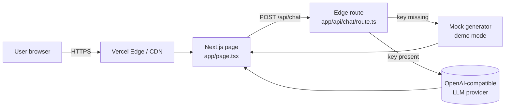
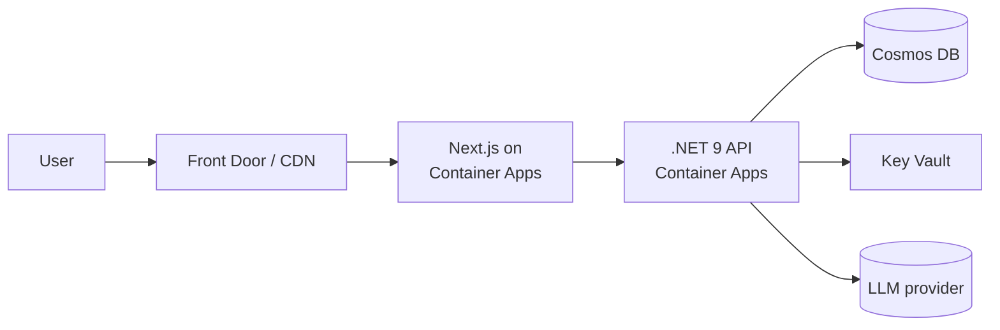

# Architecture

> Travel Assistant — design rationale and roadmap.

## Phase 1 (deployed): Free-tier Next.js demo

**Goal**: a public URL meeting attendees can open and use, with $0 hosting cost and no signup.

### Components

| Component        | Tech                       | Hosting                  | Cost |
| ---------------- | -------------------------- | ------------------------ | ---- |
| Chat UI          | Next.js 16, React 19, Tailwind v4 | Vercel Hobby (static)    | Free |
| `/api/chat`      | Next.js Edge Route Handler | Vercel Edge Functions    | Free (within Hobby limits) |
| LLM (optional)   | Any OpenAI-compatible API  | Groq free tier (default) | Free |

### Request flow

1. User types a message in `page.tsx` (client component, `useState` for history).
2. The browser POSTs `{ messages: [...] }` to `/api/chat`.
3. The edge handler:
   - If `OPENAI_API_KEY` is **not** set → returns a deterministic mock reply.
   - If set → forwards to `${OPENAI_BASE_URL}/chat/completions` with a travel-planner system prompt.
   - On upstream error, falls back to mock with an inline note (graceful degradation).
4. Reply is rendered as a chat bubble; UI shows a `mode` badge (`demo` / `live`).

### Key design decisions

| Decision | Rationale |
| -------- | --------- |
| **Next.js fullstack** (not separate API) | One deploy, no CORS, single free tier slot. |
| **Edge runtime** | Cold-start friendly, fits Vercel Hobby quotas, no Node-only deps needed. |
| **OpenAI-compatible interface, not the SDK** | Lets users pick Groq (free), OpenAI, OpenRouter, etc. without code changes. |
| **Demo mode by default** | Public URL works for testers with zero provisioning. |
| **No client-side API key** | Keys stay server-side as Vercel env vars; UI never sees them. |
| **No database in Phase 1** | Chat history lives in browser state only — simplest free demo. |

### What's deliberately *not* here yet

- Auth / accounts
- Persistent trip storage
- Real flight/hotel search (Amadeus, Skyscanner, etc.)
- Telemetry / analytics
- Rate limiting beyond Vercel defaults

These are all Phase 2/3.

---

## Phase 2 (scaffolded, not deployed): .NET on Azure

The repo already contains the Phase 2 production target — it is intentionally **not** running yet because it isn't free.

| Component | Location in repo |
| --------- | ---------------- |
| .NET 9 minimal API (`/health`, `/api/search`) | `src/TravelAssistant.Api/` |
| Bicep IaC (Container Apps, Cosmos, Key Vault) | `infra/bicep/` |
| Solution file | `TravelAssistant.slnx` |

### Phase 1 → Phase 2 migration plan

1. **Extract the chat contract.** The `/api/chat` shape (`{ messages }` in, `{ reply, mode }` out) becomes a stable interface. The .NET API implements the same contract.
2. **Switch web `fetch` target.** Replace `/api/chat` with `${process.env.NEXT_PUBLIC_API_BASE}/api/chat`. Local dev keeps working unchanged.
3. **Move LLM call into .NET.** The Next edge route becomes a thin proxy or is removed; key handling moves to Key Vault + managed identity.
4. **Add Cosmos** for trip persistence and user history.
5. **Stand up infra** with `az deployment sub create -f infra/bicep/main.bicep`.

---

## Phase 3 (future)

- Real flight/hotel search (Amadeus self-service is free up to N calls/month).
- Per-user trip memory (Cosmos partitioned by user id).
- Server-sent events / streaming responses.
- Voice input via Web Speech API.
- Multi-language UI.

---

## Decision log

| Date       | Decision | Author |
| ---------- | -------- | ------ |
| 2025-01    | Use Next.js fullstack on Vercel free tier for the public demo; keep .NET + Bicep scaffolds for Phase 2. | Ralph (Squad) |
| 2025-01    | Mock-mode-by-default so meeting attendees can use the URL without any provisioning. | Ralph (Squad) |
| 2025-01    | OpenAI-compatible HTTP interface instead of OpenAI SDK — keeps provider choice open (Groq recommended for free tier). | Ralph (Squad) |
