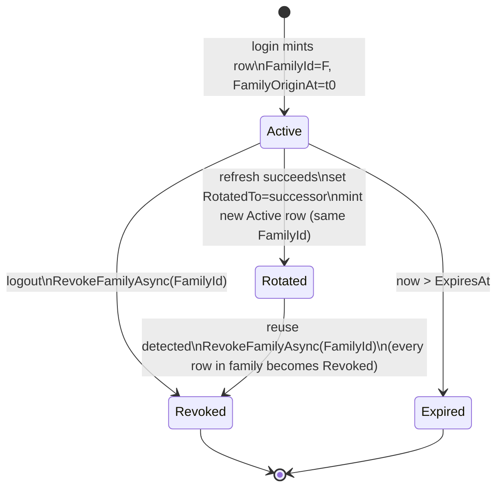
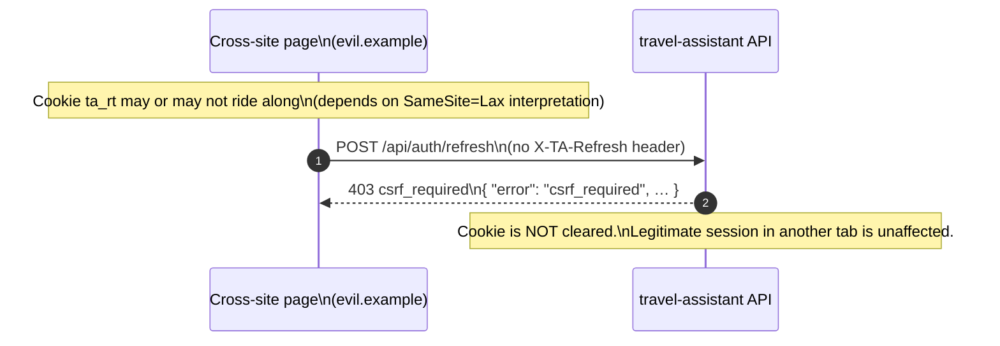

# Remember Me API Contract

| Field            | Value                                                         |
|------------------|---------------------------------------------------------------|
| Feature          | Remember Me (persistent login)                                |
| Status           | Implemented — canonical spec for shipped behavior             |
| Source repo      | `tamirdresher/travel-assistant`                               |
| Source branch    | `feature/rm-003-rm-004-remember-me`                           |
| Source commit    | `245e6d0` (authoritative)                                     |
| Threat model     | `RM-005` (authoritative)                                      |
| Owner            | Backend / API squad                                           |
| Audience         | API consumers (web SPA, future mobile), security reviewers    |

> **Scope.** This document defines the wire-level contract for the three endpoints that participate in the
> Remember Me flow: `POST /api/auth/login`, `POST /api/auth/refresh`, `POST /api/auth/logout`. It documents
> behavior as shipped in commit `245e6d0`; any divergence between this spec and that commit is a bug in the
> spec, not the code. For security rationale (cookie attributes, CSRF posture, family-revoke trigger) the
> authoritative source is threat model **RM-005**.

---

## 1. Endpoints

| Method | Path                     | Auth required             | Request body                              | Success response                                              | Status codes              |
|--------|--------------------------|---------------------------|-------------------------------------------|----------------------------------------------------------------|---------------------------|
| POST   | `/api/auth/login`        | none (anonymous)          | JSON `{ email, password, rememberMe? }`   | `200` JSON `{ accessToken, expiresInSeconds, user }` + `Set-Cookie: ta_rt=…` | `200`, `400`, `429`       |
| POST   | `/api/auth/refresh`      | `ta_rt` cookie + CSRF hdr | _(none — body MUST be empty)_             | `200` JSON `{ accessToken, expiresInSeconds }` + `Set-Cookie: ta_rt=…` (rotated) | `200`, `401`, `403`, `429`|
| POST   | `/api/auth/logout`       | `ta_rt` cookie + CSRF hdr | _(none — body MUST be empty)_             | `204` empty body + `Set-Cookie: ta_rt=; Max-Age=0`             | `204`, `401`, `403`       |

Notes:
- Access tokens (`accessToken`) are short-lived bearer JWTs with a **15 min** lifetime (`expiresInSeconds = 900`).
- Refresh tokens are **never** returned in the response body. They live exclusively in the `ta_rt` HttpOnly cookie.
- `user` (login only) is the public user projection (`id`, `email`, `displayName`, …). Its schema is owned by the user resource spec; it is opaque here.
- `rememberMe` defaults to `false` if omitted or non-boolean.

### 1.1 `POST /api/auth/login` — request body

```json
{
  "email": "user@example.com",
  "password": "…",
  "rememberMe": true
}
```

| Field        | Type    | Required | Default | Notes                                                                                  |
|--------------|---------|----------|---------|----------------------------------------------------------------------------------------|
| `email`      | string  | yes      | —       | Normalised server-side (trim, lower-case) before lookup.                               |
| `password`   | string  | yes      | —       | Verified against hashed credential.                                                    |
| `rememberMe` | boolean | no       | `false` | Selects the **Long** lifetime profile and persists in the DB row for the whole family. |

### 1.2 `POST /api/auth/refresh` — semantics

- The request **MUST** carry the `ta_rt` cookie and the `X-TA-Refresh: 1` header.
- The request **MUST NOT** carry a body. `rememberMe` is **never** read from the request — it is read from the DB row that the cookie resolves to. This is by design (RM-005): an attacker who steals a non-persistent cookie cannot promote it to a persistent one.
- On success the server rotates the token (see §4) and issues a new `Set-Cookie: ta_rt=…` with the same lifetime profile as the family.

### 1.3 `POST /api/auth/logout` — semantics

- Same auth requirements as refresh.
- Revokes the **entire token family** (every row sharing `FamilyId`), not just the presented row. See §4.
- Clears the cookie regardless of whether revocation found a matching row (idempotent from the client's perspective).

---

## 2. Cookie contract — `ta_rt`

### 2.1 Attribute matrix

| Attribute     | Value                                                | Why                                                                                                                                |
|---------------|------------------------------------------------------|------------------------------------------------------------------------------------------------------------------------------------|
| Name          | `ta_rt`                                              | Project-prefixed to avoid collisions with other apps under the same parent domain in dev/preview environments.                     |
| Value         | opaque, server-issued, ≥ 32 bytes of entropy (base64)| Not a JWT — looked up by exact match in the refresh-token store.                                                                   |
| `HttpOnly`    | **always**                                           | Prevents JS read; mitigates XSS exfiltration.                                                                                      |
| `Secure`      | **on** in non-dev environments; **off** in dev only  | Required for any production-quality cookie; relaxed in dev so `http://localhost` works.                                            |
| `SameSite`    | `Lax`                                                | Blocks the bulk of cross-site CSRF while allowing top-level navigations (e.g., returning from OAuth). CSRF gate (§3) is defense-in-depth on top. |
| `Path`        | `/api/auth`                                          | Cookie is scoped so it is **not** sent on any non-auth API call. Reduces blast radius if any other endpoint logs request headers.  |
| `Domain`      | _(unset)_                                            | Defaults to the issuing host; no subdomain sharing.                                                                                 |
| `Max-Age`     | see §2.2                                             | Hint to browser; **authoritative TTL is the DB row's `ExpiresAt`** (see §2.3).                                                     |

### 2.2 Lifetime matrix

| `rememberMe` | Profile | Cookie `Max-Age` | DB sliding window           | Absolute cap (family)                |
|--------------|---------|------------------|------------------------------|--------------------------------------|
| `false`      | Short   | 8 hours          | 8h sliding (each refresh resets to now + 8h) | _none separately_ — bounded by sliding window |
| `true`       | Long    | 30 days          | 30d sliding (each refresh resets to now + 30d) | **`FamilyOriginAt + 90d`** (`LongAbsoluteCap`) |

Implementation constants in `RefreshTokenLifetimes`:

```
Access            = 15 min
Short             = 8h   (sliding, rememberMe=false)
Long              = 30d  (sliding, rememberMe=true)
LongAbsoluteCap   = 90d  (from FamilyOriginAt, applies only to Long)
```

### 2.3 Cookie vs DB-row precedence

The cookie `Max-Age` is a **hint** for the browser. The server-side check is:

```
authoritativeExpiresAt = min(
    NewSlidingExpiresAt,            // now + Short or now + Long
    FamilyOriginAt + LongAbsoluteCap // only when profile = Long
)
```

If the cookie is presented after `ExpiresAt`, the response is `401`. The browser MAY still hold a non-expired cookie; the server ignores that — DB time is the truth.

### 2.4 Clearing the cookie

On `logout`, on `401` from `refresh`, and on any reuse-detection event (§4), the server emits:

```
Set-Cookie: ta_rt=; HttpOnly; Secure; SameSite=Lax; Path=/api/auth; Max-Age=0
```

Attributes other than `Max-Age` must match the original cookie or some browsers will refuse to overwrite it.

---

## 3. CSRF gate — `X-TA-Refresh: 1`

### 3.1 Contract

| Field    | Value                                                                 |
|----------|-----------------------------------------------------------------------|
| Header   | `X-TA-Refresh`                                                        |
| Value    | literal string `1`                                                    |
| Required on | `POST /api/auth/refresh`, `POST /api/auth/logout`                  |
| Missing or wrong value | `403 Forbidden` (see §5)                                 |

The header value is not currently parsed beyond "present and equal to `1`". Future versions MAY treat it as a version string; clients SHOULD send exactly `1`.

### 3.2 Why we have it (RM-005)

`SameSite=Lax` already blocks the most common CSRF vectors, but it is not sufficient on its own:

1. **Lax allows top-level POST in some historical browser behavior** (notably older Chrome, and the "Lax + POST" 2-minute grace window in Chrome). A custom header closes that gap.
2. **A cross-site form submission (`<form method=POST>`) cannot set custom headers.** Only same-origin JS using `fetch`/`XHR` can set `X-TA-Refresh`.
3. **A cross-origin `fetch` with `X-TA-Refresh` triggers a CORS preflight.** Our refresh and logout endpoints do not enable CORS for arbitrary origins, so the preflight fails and the actual request is never sent.
4. **Defense in depth.** If a future change widens cookie scope or relaxes `SameSite`, the CSRF header still blocks forged POSTs. Treat it as a non-negotiable second lock, not a redundant one.

### 3.3 Client guidance

A correct refresh from the SPA looks like:

```js
await fetch("/api/auth/refresh", {
  method: "POST",
  credentials: "include",        // sends ta_rt
  headers: { "X-TA-Refresh": "1" } // CSRF gate
});
```

The body must be empty. Setting `Content-Type` is harmless but unnecessary.

---

## 4. Token family — state machine

### 4.1 Concepts

| Concept            | Definition                                                                                                                                |
|--------------------|--------------------------------------------------------------------------------------------------------------------------------------------|
| **Family**         | The set of all refresh-token rows that descend from a single login. Identified by `FamilyId` (assigned at login, copied through rotations). |
| **FamilyOriginAt** | UTC timestamp of the original login. Used as the anchor for `LongAbsoluteCap`. Never changes through rotations.                            |
| **Active**         | Row is the current usable token: `RevokedAt IS NULL`, `RotatedTo IS NULL`, `ExpiresAt > now`.                                              |
| **Rotated**        | Row has been used in a successful refresh: `RotatedTo` points at the successor row. Cannot be used again — presenting it triggers reuse detection. |
| **Revoked**        | Row has `RevokedAt` set. Cannot be used; presenting it returns `401`. Set by logout or by reuse detection.                                 |
| **Expired**        | `ExpiresAt <= now`. Cannot be used. (Row may also be Rotated; expiration is checked first on presentation.)                                |
| **Reuse**          | A row whose `RotatedTo` is already set is presented again. Treated as compromise → `RevokeFamilyAsync(FamilyId)` is invoked.               |

### 4.2 State diagram



### 4.3 Refresh algorithm (informative, matches `245e6d0`)

```
function Refresh(cookieValue):
    require header "X-TA-Refresh: 1" else 403
    require cookieValue present else 401

    row = TokenStore.FindByValue(cookieValue)
    if row is null                 -> 401
    if row.ExpiresAt <= now        -> 401   (also clear cookie)
    if row.RevokedAt is not null   -> 401   (also clear cookie)
    if row.RotatedTo is not null:                                # REUSE
        RevokeFamilyAsync(row.FamilyId)
        clear cookie
        return 401

    # Happy path — rotate
    profile        = row.RememberMe ? Long : Short
    newSliding     = now + profile.Sliding
    newExpiresAt   = row.RememberMe
                     ? min(newSliding, row.FamilyOriginAt + LongAbsoluteCap)
                     : newSliding

    successor = TokenStore.Insert(
        Value          = randomOpaque(),
        FamilyId       = row.FamilyId,
        FamilyOriginAt = row.FamilyOriginAt,
        RememberMe     = row.RememberMe,
        ExpiresAt      = newExpiresAt
    )

    TokenStore.Update(row.Id, RotatedTo = successor.Id, RotatedAt = now)

    setCookie("ta_rt", successor.Value, MaxAge = profile.Sliding)
    return 200 { accessToken = mintAccessToken(row.UserId), expiresInSeconds = 900 }
```

### 4.4 Why the entire family is revoked on reuse

If we revoked only the presented (Rotated) row, we would leave the **successor** active. Either:

- the legitimate client holds the successor — fine, but then the attacker keeps using stale rows in a loop hoping to hit one we missed; OR
- the attacker holds the successor (they rotated first) — and the legitimate client is the one re-presenting the old token.

Because we cannot distinguish those cases from the server side, the safe action is: **invalidate the whole family and force a fresh login.** That guarantees an attacker who stole any one token loses access on the next refresh by either party. See RM-005 for full rationale.

---

## 5. Error catalogue

All error responses use:

```
Content-Type: application/json; charset=utf-8
```

with the following shape:

```json
{
  "error":   "<machine_code>",
  "message": "<human-readable, may be shown in UI>"
}
```

Additional fields (`retryAfterSeconds`, etc.) are documented per error.

| HTTP | `error`               | When                                                                                              | Side effects                          | Example body                                                                 |
|------|-----------------------|---------------------------------------------------------------------------------------------------|---------------------------------------|------------------------------------------------------------------------------|
| 400  | `invalid_credentials` | `login`: email not found, or password mismatch. **Same response for both** (no user enumeration). | none                                  | `{ "error": "invalid_credentials", "message": "Email or password is incorrect." }` |
| 400  | `invalid_request`     | Malformed JSON, missing `email`/`password`, wrong content-type.                                   | none                                  | `{ "error": "invalid_request", "message": "Request body is malformed." }`    |
| 401  | `invalid_refresh`     | `refresh`/`logout`: cookie absent, not found, expired, revoked, **or reuse detected** (§4.3).     | Clears `ta_rt`; if reuse → family revoked | `{ "error": "invalid_refresh", "message": "Refresh token is missing, expired, or revoked." }` |
| 403  | `csrf_required`       | `refresh`/`logout`: `X-TA-Refresh: 1` header absent or has a different value.                     | none (cookie untouched)               | `{ "error": "csrf_required", "message": "X-TA-Refresh header is required for this endpoint." }` |
| 429  | `rate_limited`        | `login`/`refresh`: rate limit tripped. **Concrete thresholds are TBD** (not wired as of `245e6d0`). | none                                  | `{ "error": "rate_limited", "message": "Too many requests. Retry after 60s.", "retryAfterSeconds": 60 }` |

> ⚠️ **Open item — rate limiting.** Commit `245e6d0` reserves the `429` code path but does not wire concrete limits.
> Thresholds (per-IP, per-account) will be defined in a follow-up. Clients SHOULD already handle `429` and
> the `Retry-After` header on this date.

### 5.1 Reuse-detection response is indistinguishable from "expired"

Both reuse and ordinary expiry return `401 invalid_refresh` with the same body and the same `Set-Cookie`
clearing header. This is intentional (RM-005): the client cannot tell whether it was the victim of a
family revocation or simply waited too long. UX impact is the same — redirect to login.

---

## 6. Sequence diagrams

### 6.1 Happy path: login → refresh → logout

```mermaid
sequenceDiagram
    autonumber
    participant C as Client (SPA)
    participant API as travel-assistant API
    participant DB as Refresh-token store

    C->>API: POST /api/auth/login\n{ email, password, rememberMe: true }
    API->>DB: Verify credentials
    API->>DB: INSERT row r1\nFamilyId=F1, FamilyOriginAt=t0,\nRememberMe=true, ExpiresAt=t0+30d
    DB-->>API: ok (r1)
    API-->>C: 200\n{ accessToken, expiresInSeconds: 900, user }\nSet-Cookie: ta_rt=opaque1; HttpOnly; Secure; SameSite=Lax; Path=/api/auth; Max-Age=2592000

    Note over C,API: ~15 min later — access token near expiry

    C->>API: POST /api/auth/refresh\nCookie: ta_rt=opaque1\nX-TA-Refresh: 1
    API->>DB: Lookup r1; assert Active; read RememberMe=true
    API->>DB: INSERT r2\nFamilyId=F1, FamilyOriginAt=t0,\nExpiresAt=min(now+30d, t0+90d)
    API->>DB: UPDATE r1 SET RotatedTo=r2, RotatedAt=now
    DB-->>API: ok
    API-->>C: 200\n{ accessToken, expiresInSeconds: 900 }\nSet-Cookie: ta_rt=opaque2; …; Max-Age=2592000

    Note over C,API: user signs out

    C->>API: POST /api/auth/logout\nCookie: ta_rt=opaque2\nX-TA-Refresh: 1
    API->>DB: RevokeFamilyAsync(F1)\n→ UPDATE … SET RevokedAt=now WHERE FamilyId=F1
    API-->>C: 204\nSet-Cookie: ta_rt=; …; Max-Age=0
```

### 6.2 Reuse detection: family revoke

```mermaid
sequenceDiagram
    autonumber
    participant L as Legitimate Client
    participant X as Attacker (stole opaque1 earlier)
    participant API as travel-assistant API
    participant DB as Refresh-token store

    L->>API: POST /api/auth/refresh\nCookie: ta_rt=opaque1\nX-TA-Refresh: 1
    API->>DB: Lookup r1 (Active); rotate
    API->>DB: INSERT r2 (FamilyId=F1)\nUPDATE r1.RotatedTo=r2
    API-->>L: 200 + Set-Cookie: ta_rt=opaque2

    Note over X: presents the stolen, now-Rotated token

    X->>API: POST /api/auth/refresh\nCookie: ta_rt=opaque1\nX-TA-Refresh: 1
    API->>DB: Lookup r1 → RotatedTo=r2 ⇒ REUSE
    API->>DB: RevokeFamilyAsync(F1)\n→ r1, r2 (and any siblings) → Revoked
    API-->>X: 401 invalid_refresh\nSet-Cookie: ta_rt=; Max-Age=0

    Note over L: legitimate client's next refresh

    L->>API: POST /api/auth/refresh\nCookie: ta_rt=opaque2\nX-TA-Refresh: 1
    API->>DB: Lookup r2 → RevokedAt is set
    API-->>L: 401 invalid_refresh\nSet-Cookie: ta_rt=; Max-Age=0
    Note over L: client must re-authenticate via /login
```

### 6.3 CSRF-gate rejection (for reference)



---

## 7. Conformance checklist (for reviewers)

A client/server implementation is compliant with this spec iff:

- [ ] Login response body **never** contains a refresh token.
- [ ] Cookie attributes match §2.1 exactly in production; `Secure` MAY be omitted only in dev.
- [ ] Cookie `Max-Age` reflects the `rememberMe` chosen at login (§2.2).
- [ ] `rememberMe` is **never** read from a refresh request — only from the DB row (§1.2).
- [ ] `refresh` and `logout` return `403` when `X-TA-Refresh: 1` is missing (§3.1), without touching the cookie.
- [ ] Rotation preserves `FamilyId` and `FamilyOriginAt` (§4.1).
- [ ] Long-profile `ExpiresAt` is clamped by `FamilyOriginAt + 90d` (§4.3).
- [ ] Presenting a Rotated token triggers `RevokeFamilyAsync` (§4.3, §4.4).
- [ ] All `401` paths on refresh/logout also emit a clearing `Set-Cookie` (§2.4).
- [ ] Reuse-detection and ordinary-expiry responses are byte-for-byte indistinguishable to the client (§5.1).

---

## 8. Authoritative references

- **Code:** commit `245e6d0` on branch `feature/rm-003-rm-004-remember-me` in `tamirdresher/travel-assistant`.
  Any conflict between this document and the code at that commit is a documentation bug.
- **Security rationale:** threat model **RM-005**.
  Cookie attribute choices (§2.1), the CSRF-gate decision (§3.2), and the family-revoke-on-reuse policy
  (§4.4) all derive from RM-005 and MUST NOT be relaxed without updating that threat model first.

## 9. Open items

| Item                       | Notes                                                                                  |
|----------------------------|----------------------------------------------------------------------------------------|
| Rate-limit thresholds      | `429` path is reserved (§5) but concrete per-IP / per-account limits are not yet set. |
| Device / session listing   | Out of scope here; the family model is forward-compatible with a future `/api/auth/sessions` endpoint that lists active `FamilyId`s per user. |
| Mobile clients             | Cookie-based contract is web-first. Native clients will need a separate token-binding story (out of scope; covered by a future RFC). |
